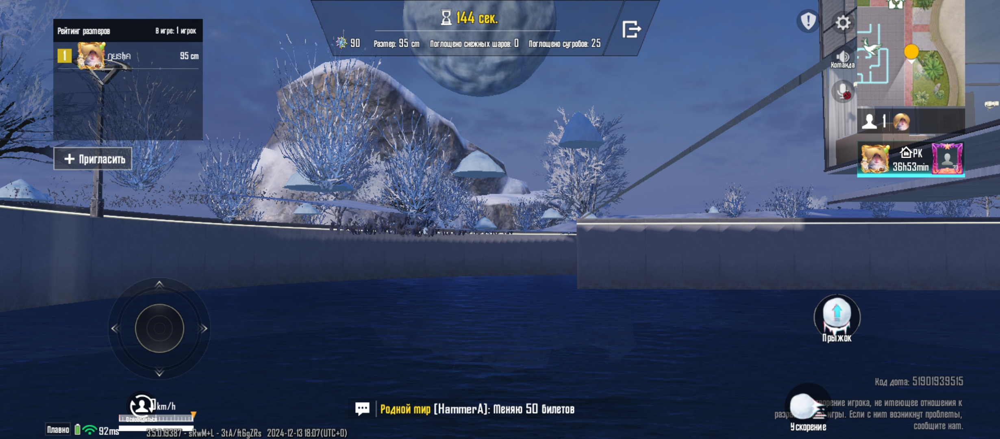

# Баг: камера проваливается под текстуру в мини-игре

## Описание
В зимнем событии (мини-игра снежный шар) при выходе из меню настроек камера провалилась сквозь землю.
Земля стала прозрачной для камеры, но не для персонажа (снежного шара).

## Примечание
Баг был найден зимой 04.01.2025. На момент оформления событие уже убрано из игры.

## Шаги воспроизведения
1. Зайти в режим 'Дом'
2. Начать мини-игру с шариком
3. Открыть меню настроек
4. Закрыть меню настроек

## Ожидаемый результат
Камера возвращается в нормальное местоположение.

## Фактический результат
Камера проваливается сквозь землю, земля прозрачная.

## Приоритет
Medium

## Скриншот
