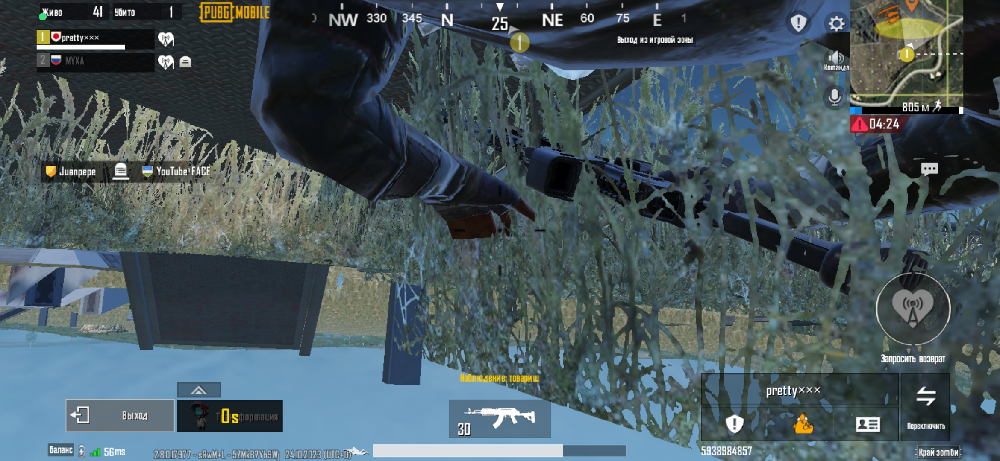

# Баг: камера проваливается под текстуру в режиме Королевской битвы (Classic)

## Описание
В королевской битве при переключении камеры слежения за союзником камера провалилась сквозь землю.
Земля стала прозрачной для камеры, но не для персонажа.

## Примечание
Баг был найден 26.11.2023. До сих пор не исправлен.
Баг редкий — воспроизводится примерно 1 раз на 1000 попыток.

## Шаги воспроизведения
1. Зайти в режим Королевская битва
2. При сражении умереть
3. Камера автоматически переключит на 'Слежение за союзника'
4. Нажать кнопку 'Трансформация в питомца'
5. Выйти из трансформации
6. Камера вновь автоматически переключит на 'Слежение за союзника'

## Ожидаемый результат
Камера возвращается в нормальное местоположение.

## Фактический результат
Камера проваливается сквозь землю, земля прозрачная.

## Severity
Trivial

## Priority
Low

## Скриншот

