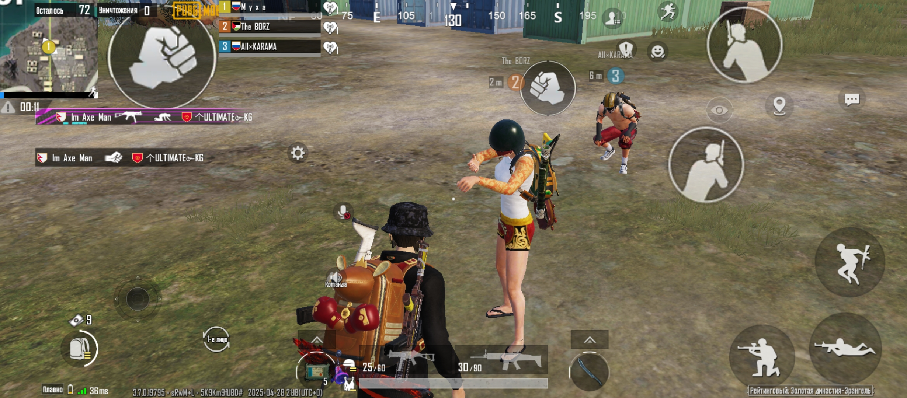

# Баг: Невидимое оружие у союзника в режиме Classic

## Описание
Союзник берёт оружие — у него оно видимое, у меня невидимое.

## Примечание
Баг найден 06.06.2025. До сих пор не исправлен.
Баг редкий — воспроизводится примерно 1 раз на 1000 попыток.

## Шаги воспроизведения
1. Зайти в режим королевская битва
2. Приземлиться на поле битвы
3. Зайти в меню настроек
4. Союзник берёт оружие
5. Выйти из меню настроек

## Ожидаемый результат
Оружие видимое.

## Фактический результат
Оружие невидимое.

## Приоритет
Low

## Скриншот
